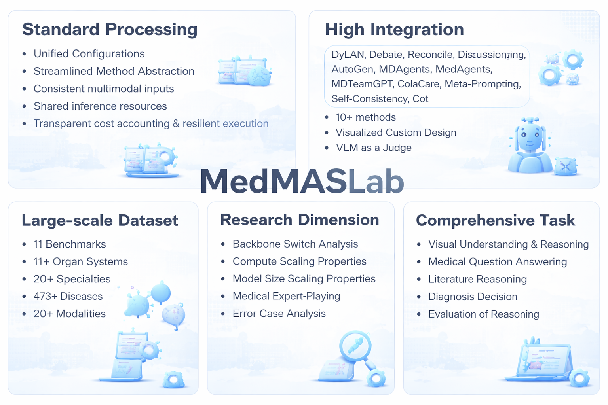
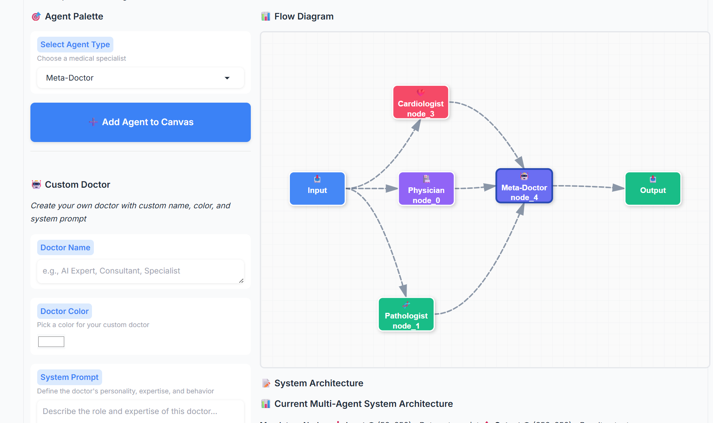

<h1 align="center" style="margin-top: -35px;"><b>MedMASLab: A Unified Orchestration Framework for Benchmarking Multimodal Medical Multi-Agent Systems</b></h1>

[📄 **Paper**](https://arxiv.org/abs/2603.09909) · [🤗 **Dataset**](https://huggingface.co/datasets/qyhhhhh/MedMASLab_dataset)

## 📋 Overview
MedMASLab is the **unified, comprehensive benchmarking platform** specifically designed for medical vision-language multi-agent systems. It addresses critical challenges in the medical AI field by providing standardized infrastructure, rigorous evaluation metrics, and extensive empirical insights.  

---

<p align="center">
  
</p>

## 🎯 Core Contributions

### 1️⃣ **Unified Orchestration Framework**
- 🔗 **Seamless Integration**: Orchestrates 11 heterogeneous MAS architectures across 24 medical modalities
- 📊 **Standardized Protocol**: Provides unified agent communication protocol with standardized inference interface `R = (y, Γ, Θ)`
- 🏗️ **Composable Design**: Abstracts inter-agent communication from modality-specific feature extraction
- 📈 **Scalability**: Standardizes evaluation across 11 organ systems and 473 diseases

### 2️⃣ **VLM-Based Semantic Evaluation Engine**
- 🧠 **Zero-Shot Assessment**: Replaces brittle rule-based string matching with semantic judgment using vision-language models
- 🎨 **Multimodal-Aware Evaluation**: Provides judge model with identical visual context (radiographs, video frames) for verification
- 📌 **Format-Agnostic**: Overcomes formatting-induced noise through semantic equivalence assessment
- ✅ **Visual Grounding**: Ensures agent reasoning is consistent with primary visual evidence, not just text coherence

### 3️⃣ **Comprehensive Empirical Findings**
- ⚠️ **Fragility Gap**: Exposes critical vulnerabilities in current MAS when transitioning between medical sub-domains
- 🔍 **Task-Specificity Penalty**: Quantifies high task-specificity but limited generalizability across benchmarks
- 💰 **Cost-Performance Trade-off**: Provides rigorous analysis of token efficiency vs. accuracy frontiers
- 🎓 **Architectural Insights**: Characterizes Pareto frontier between agent complexity, inference cost, and clinical robustness

---

## 🔥 News
If you want a comprehensive understanding of the landscape of medical agents, visit our curated survey of 300+ papers: [Landmark-of-medical-agent](https://github.com/NUS-Project/Landmark-of-medical-agent)

## 🏆 Performance Comparison: General-Task vs Medicine-Specific MAS Methods
This table compares the performance of general-task and medicine-specific methods across five aspects in the medical domain:
- **Medical Literature Reasoning** (PubMedQA)
- **Medical Question Answering** (MedQA, MedBullets, MMLU)
- **Medical Visual Understanding and Reasoning** (VQA-RAD, SLAKE-En, MedVidQA, MedCMR, MedXpertQA-MM)
- **Diagnosis Decision** (DxBench)
- **Evaluation of Medical Reasoning Chains** (M3CoTBench)

Avg-V denotes the average accuracy (↑). **Bold** indicates the best performance.

## Qwen-2.5VL-7B-Instruct

| Method | PubMedQA | MedQA | MedBullets | MMLU | VQA-RAD | SLAKE-En | MedVidQA | MedCMR | MedXpertQA-MM | DxBench | M3CoTBench | Avg-V |
|--------|----------|-------|-----------|------|---------|----------|----------|--------|---------------|---------|-----------|-------|
| Single | 68 | 52.8 | 35.7 | 75.2 | 50.4 | 58.3 | 71.6 | 68.1 | 20.8 | 62.9 | 30.8 | 54.1 |
| Debate | 68.4 | 52.9 | 37.1 | 76.6 | 54.1 | 64.4 | 76.4 | 64.5 | 21.6 | 64.2 | 34 | 55.9 |
| MDAgents | 68 | 52.3 | 38.4 | 73.9 | 56.6 | 63.8 | <u>79.1</u> | <u>68.9</u> | 22.6 | 64.7 | **36.8** | <u>56.8</u> |
| MDTeamGPT | **79.4** | <u>56.1</u> | <u>39</u> | **77.6** | 50.3 | 58.3 | 71.6 | 62.7 | **23.4** | <u>64.9</u> | <u>34.6</u> | 56.2 |
| Discussion | 56 | 52.3 | 35.2 | 74 | <u>57.3</u> | **65.3** | 75 | 65.9 | 23.3 | 61.5 | 31.8 | 54.3 |
| Reconcile | 70.8 | 52.9 | 35.2 | 76 | 54.1 | 58.8 | 71.9 | 66.2 | 22.1 | 63.8 | 30.6 | 54.8 |
| Meta-Prompting | 70.6 | 52.6 | 38 | 73.4 | 51.7 | 58.2 | 78.7 | 61.6 | 21.1 | 64.2 | 29.9 | 54.6 |
| AutoGen | <u>73</u> | 50.7 | 36.7 | 73.3 | 56.6 | 62.1 | 77.1 | 67.3 | <u>23.3</u> | 61.7 | 28.4 | 55.5 |
| DyLAN | 62.4 | 53.1 | 35.1 | 75.2 | 47.7 | 58.4 | 69.6 | 64.6 | 21.6 | 63.3 | 33.9 | 53.2 |
| MedAgents | 71 | **56.7** | **41.9** | 75.3 | 49.5 | 58.9 | 73 | **72.9** | 21.5 | **65.2** | 29.2 | 55.9 |
| ColaCare | 71.4 | 54.9 | 38.4 | <u>77.4</u> | **59.5** | <u>65.2</u> | **80.5** | 67.9 | 21.6 | 64.5 | 28.8 | **57.3** |

## LLaVA-v1.6-mistral-7b-hf

| Method | PubMedQA | MedQA | MedBullets | MMLU | VQA-RAD | SLAKE-En | MedVidQA | MedCMR | MedXpertQA-MM | DxBench | M3CoTBench | Avg-V |
|--------|----------|-------|-----------|------|---------|----------|----------|--------|---------------|---------|-----------|-------|
| Single | 56.6 | 39.2 | 31.2 | 59.9 | 50.8 | 50.7 | 56.1 | 53.3 | 21.8 | 57.6 | 31.9 | 46.3 |
| Debate | 55 | 43.6 | 33.8 | 59 | <u>52.8</u> | 53.1 | 57 | 49.8 | 20.2 | 58.1 | 33.5 | 46.9 |
| MDAgents | 60.6 | 40.6 | 31.5 | 58.8 | **54.6** | 53.1 | 64.9 | 52.8 | 21.3 | 54.3 | **34.8** | 47.9 |
| MDTeamGPT | <u>65.7</u> | 41.8 | **35.8** | <u>62.4</u> | 53.2 | 50.9 | 58.5 | 48 | 21.4 | 57.3 | 33.1 | <u>48</u> |
| Discussion | **72.3** | 39.8 | 30.2 | 61.9 | 49.3 | 52.8 | 51.4 | 48.3 | 22.1 | 56.5 | 32.3 | 47 |
| Reconcile | 61.8 | <u>44.5</u> | 32.6 | 58.3 | 51 | 50.4 | 59.9 | 53.7 | 20.5 | 52.6 | 32.5 | 47.1 |
| Meta-Prompting | 53.4 | 40.8 | 32.2 | 60 | 51.4 | 52.8 | 63.5 | 54.7 | 22.4 | <u>58.2</u> | 30.3 | 47.3 |
| AutoGen | 58.1 | 38 | 29.9 | 57 | 51.3 | 50 | **73.7** | 47 | **22.7** | 52 | 31 | 46.5 |
| DyLAN | 44.8 | 37.8 | 30.2 | 58.4 | 50.9 | **56.4** | 60.9 | <u>57.2</u> | 20.4 | 54.2 | 32.5 | 45.8 |
| MedAgents | 53.6 | 42.5 | <u>33.9</u> | **63.8** | 48.6 | 51 | 51.4 | 56.1 | 22.2 | **58.8** | 32 | 46.7 |
| ColaCare | 62.4 | **46.1** | 31.9 | 58.5 | 52.4 | 51.8 | <u>73</u> | **59.6** | <u>22.5</u> | 56.2 | <u>34.7</u> | **49.9** |

## 🔬 Getting Started

### Prerequisites

1. Python 3.11
2. PyTorch: 2.6.0+cu124
3. Transformers: 4.57.6
4. vLLM: 0.8.0
5. gradio: 4.44.1


## ⚙️ Usage

### 🔍 Dataset Download:
The MedMASLab benchmarking dataset is publicly available on Hugging Face:

**🔗 [Download Dataset from Hugging Face](https://huggingface.co/datasets/qyhhhhh/MedMASLab_dataset/tree/main)**

### 🎯Running Medical Benchmark
#### First start your base model vllm serve 
```bash
vllm serve path/to/your model \
      --tensor-parallel-size 8 \
      --gpu-memory-utilization 0.85 \
      --dtype auto \
      --served-model-name Qwen2.5-VL-7B-Instruct \
      --host 0.0.0.0 \
      --port 8016 \
      --max-model-len 120000 \
      --max-num-seqs 128 \
      --limit-mm-per-prompt image=32,video=5 \
      --trust-remote-code

```
#### Second start your judge model vllm serve 
```bash
vllm serve path/to/your model \
      --tensor-parallel-size 2 \
      --gpu-memory-utilization 0.85 \
      --dtype auto \
      --served-model-name Qwen2.5-VL-32B-Instruct \
      --host 0.0.0.0 \
      --port 8016 \
      --max-model-len 8096 \
      --max-num-seqs 128 \
      --limit-mm-per-prompt image=32,video=5 \
      --trust-remote-code

```
### Run Debate on specific MedQA task
```
python path/to/main.py \
        --model Debate \
        --dataset_name medqa \
        --batch_size 128 \
        --num_workers 128 \
        --judge_batch_size 128 \
        --save_interval 400 \
        --num_samples 1000000 \
        --base_model Qwen2.5-VL-7B-Instruct

```

## 🎨  User Visualization & Interactive Operations Interface

MedMASLab provides a **comprehensive, intuitive web-based graphical user interface (GUI)** designed to democratize access to medical multi-agent system research. You can learn how to use it by watching the video [https://www.youtube.com/watch?v=9Neo5jfgQEg](https://www.youtube.com/watch?v=9Neo5jfgQEg).
run:
```
python web.py
```
<p align="center">
  
</p>
📝 Citation
If you find our code, data, models, or the paper useful, please cite the paper:

```bibtex
@misc{qian2026medmaslabunifiedorchestrationframework,
      title={MedMASLab: A Unified Orchestration Framework for Benchmarking Multimodal Medical Multi-Agent Systems}, 
      author={Yunhang Qian and Xiaobin Hu and Jiaquan Yu and Siyang Xin and Xiaokun Chen and Jiangning Zhang and Peng-Tao Jiang and Jiawei Liu and Hongwei Bran Li},
      year={2026},
      eprint={2603.09909},
      archivePrefix={arXiv},
      primaryClass={cs.AI},
      url={https://arxiv.org/abs/2603.09909}, 
}
```


